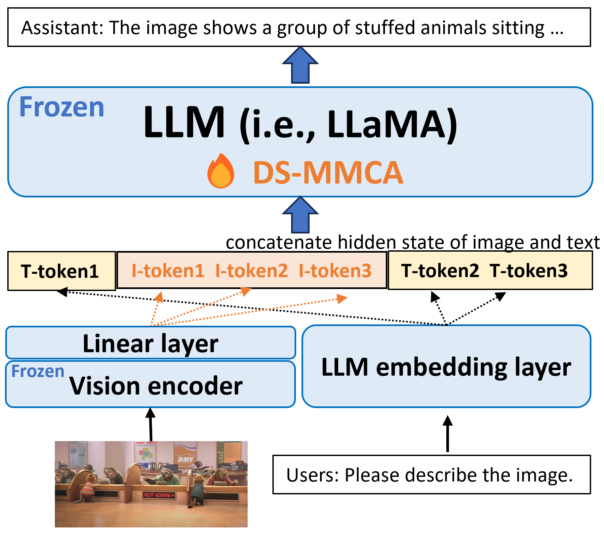

## Introduction
We propose the first large multi-modal based video quality assessment (LMM-VQA) model, which introduces a novel spatiotemporal visual modeling strategy for quality-aware feature extraction. Specifically, we first reformulate the quality regression problem into a question and answering (Q\&A) task and construct Q\&A prompts for VQA instruction tuning. Then, we design a spatiotemporal vision encoder to extract spatial and temporal features to represent the quality characteristics of videos, which are subsequently mapped into the language space by the spatiotemporal projector for modality alignment. Finally, the aligned visual tokens and the quality-inquired text tokens are aggregated as inputs for the large language model to generate the quality score as well as the quality level. Extensive experiments demonstrate that LMM-VQA achieves state-of-the-art performance across five VQA benchmarks, exhibiting an average improvement of 5% in generalization ability over existing methods. Furthermore, due to the advanced design of the spatiotemporal encoder and projector, LMM-VQA also performs exceptionally well on general video understanding tasks, further validating its effectiveness.
<!-- 
<p align="center">

</p> -->

## Installation Guide
Create a virtual environment to run the code of LMM-VQA.<br>
```
cd ds-vqa-yuyu
conda create -n llm-vqa python=3.9
conda activate llm-vqa
pip install -r requirements.txt
```

## Data preparation


## Quick Demos
1. Place the datasets under `./dataset`
2. Train the model. We provide experiment scripts under the folder `./scripts`. For instance, you can train the model with text and SMILES representations by:
```bash
bash ./training/training_scripts/run_7b.sh
```
3. Evaluate the model.
```bash
bash ./eval/eval_scripts/run_single.sh 
```